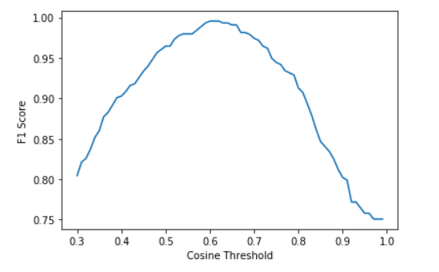
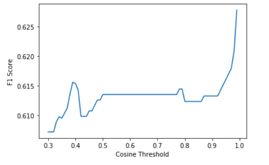
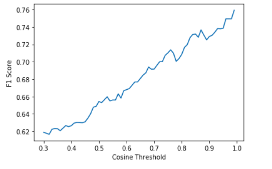

# Face Matching


## About

This repository contains pytorch implementation of One-Shot learning for face recogntion


## Files

- [`train.py`](train.py) : Python code for training the algorithm 
- [`backbone/trainer.py`](trainer.py) : A helper function that support the train script
- [`pretrained`](pretrained) : Contains a pretrained model (Inception-Resnet-V1) trained on VGGFace dataset using Facenet (Inception-Resnet-V1 with triplet loss)
- [`backbone`](backbone) : folder containing the helper functions for one-shot learning pipeline
- [`Notebooks`](Notebooks) : Contains dataloader, inference and experiment analysis modules as jupyter notebooks when 50 % couple of similar and 50 % of dissimilar images as data is fed into the model to learn the embeddings with Contrastive loss
- [`Notebooks_triplet`](Notebooks_triplet) : Contains dataloader, inference and experiment analysis modules as jupyter notebooks when a triplet is constructed (A,P,N) and fed into the model to learn the last layer embeddings with Triplet Loss
- [`files`](files) : contains train and validation data text files containing list of randomly generated positive and negative pairs

## Usage


For training the models, run the below command

```
$ python train.py 
```

For evaulating the model, run the below command (output cosine similarity score thresholded at 0.6 [explaind below])

```
$ python eval.py --image1 Tony_Blair/Tony_Blair_0034.jpg --image2 Tony_Blair/Tony_Blair_0098.jpg
```


## About the problem !


**1. Brief overview of the problem at hand** 

**2. Architectures that have been used and experimented** 

**3. Some training strategies that have used here**

## Introduction

## Face Recognition 

Face recognition has become one of the common features used in mobile applications and a number of other machines. Recognizing human faces from images obtained by a camera is a challenging job. In face recognition systems, we want to be able to recognize a person’s identity by just feeding one picture of that person’s face to the system. 

Here, the problem of face recognition is treated as a [one-shot-learning problem](https://towardsdatascience.com/one-shot-learning-face-recognition-using-siamese-neural-network-a13dcf739e) problem. 


## Algorithms Implemented

One-shot learning are classification tasks where many predictions are required given one (or a few) examples of each class. Siamese networks are an approach to addressing one-shot learning in which a learned feature vector for the known and candidate example are compared.

Here, a **Inception-Resnet-v1** has been chosen to represent siamese network. It is supported by **Contrastive loss function** which is a distance based loss function to ensure that semantically similar images are embedded closer in the feature space


## Training Strategies 


- **Augmentation Strategies** : For train-time-augmentations, Random Affine is chose to ensure to correct and make it invariant to geometric distortions through camera angles. Also, it rotates images by few degrees to make it rotation invariant. Random contrast, brightness and saturation is added/removed from the images, Also, add vertical flip randomly.


- **Scheduler** : Reduce LR on plateu used here with initial LR of 0.01 (original facenet paper used 0.05 as initial LR)

- **Loss Function** :  Here **Contrastive loss function** is used - a distance based loss function to ensure that semantically similar images are embedded closer in the feature space. Also, triplet loss is also implemented


- **Transfer Learning** : A pretrained model trained on VGGFace is used here. Embeddings already learned on VGG FaceNet support the current training on LFW face dataset. The pre-trained model is imported from [this](https://github.com/timesler/facenet-pytorch) github repository and can be downloaded from [here](https://drive.google.com/uc?export=download&id=12DYdlLesBl3Kk51EtJsyPS8qA7fErWDX)

### Experiment Summary

| exp_name  | arch_name | pretrained_on | loss_name       | lr_scheduler_name | optimizer_name | F1 Score | Accuracy |  
|-----------|-----------|---------------|-----------------|-------------------|----------------|-----------|------------|
| exp1 | inception_resnet_v1 | Imagenet      | Triplet loss     |  reduce lr              | sgd            |  0.9953   | 0.99    | 
| exp2 | inception_resnet_v1 | VGGFace2      | Contrastive loss |  reduce lr              | adam           |  0.6277   | 0.53 |
| exp2 | inception_resnet_v1 | VGGFace2      | Triplet_loss |  reduce lr              | adam           |  0.7592   | 0.83 |

Exp1 : Inception_resnet_v1 trained on VGGFace2 is downloaded and evaluated on LFW dataset <br />
Exp2 : Inception_resnet_v1 pre-trained on VGGFace2 is downloaded and the last layer embeddings are transfer learned with the support Contrastive loss <br />
Exp3: Inception_resnet_v1 pre-trained on VGGFace2 is downloaded and the last layer embeddings are transfer learned with the support Triplet Loss <br />


**Metric Chosen** : 
F1 Score at 0.6 threshold has been chosen as the metric for evaluation. F1 score had been calculated at regular interval and it was observed it peaked at 0.6 for exp1 (during testing on LFW dataset)


#### **F1 Score Chart on LFW dataset**

##### ***Exp1***

<p align="center">
    
</p>


##### ***Exp2***

<p align="center">
    
</p>

##### ***Exp3***

<p align="center">
    
</p>